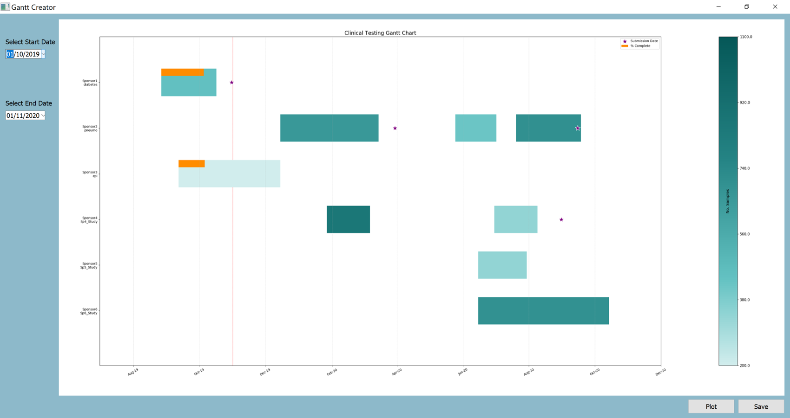

# Introduction
A quick Gantt chart builder for clinical studies. The project list csv contains columns for editing and the GUI allows 
for snapshots in time. Included is a custom colour bar based on the number of samples per study/study shipment

# Instructions
Simply tailor the project list to suit your needs, run the GUI and change the date range that you want to look at.

# Caveats
This was thrown together pretty quickly. There is very little in the way of exception handling, so the input data needs 
to resemble the dummy file. For example, if no sponsor is included, it's displayed as 'nan' on the Y axis. The aim of 
this was to serve as a template and was written with a specific number of projects in mind.

# Screenshot
